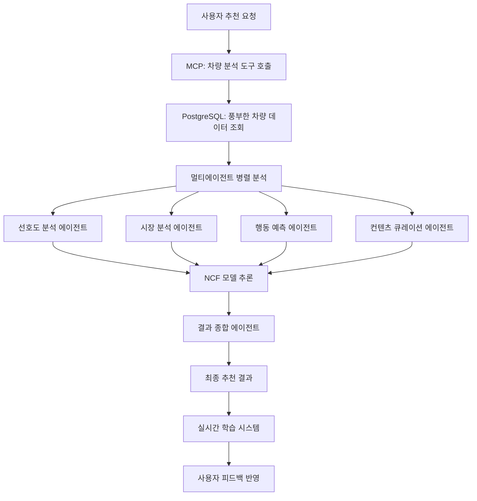

# 🚗 차량 데이터 기반 통합 AI 시스템 아키텍처

## 📊 **기존 vehicles 테이블 분석**

### **핵심 데이터 구조**
```sql
-- 식별 정보
vehicleid: ARRAY         -- 차량 고유 ID
carseq: ARRAY           -- 차량 시퀀스
vehicleno: VARCHAR      -- 차량 번호

-- 기본 속성
manufacturer: VARCHAR    -- 제조사 (현대, 기아, BMW, 벤츠 등)
model: VARCHAR          -- 모델명 (아반떼, 소나타, 320i 등)
generation: VARCHAR     -- 세대 (7세대, 8세대 등)
trim: VARCHAR           -- 트림 (프리미엄, 럭셔리, 스포츠 등)

-- 성능 정보
fueltype: VARCHAR       -- 연료타입 (가솔린, 하이브리드, 전기 등)
transmission: VARCHAR   -- 변속기 (자동, 수동, CVT 등)
cartype: VARCHAR        -- 차량 유형 (세단, SUV, 해치백 등)

-- 외관/색상
colorname: VARCHAR      -- 색상명 (흰색, 검정, 은색 등)

-- 시간/거리 정보
modelyear: ARRAY        -- 연식
firstregistrationdate: ARRAY  -- 최초 등록일
distance: ARRAY         -- 주행거리

-- 가격 정보
price: ARRAY            -- 현재 가격
originprice: ARRAY      -- 원래 가격

-- 판매 정보
selltype: VARCHAR       -- 판매 유형 (딜러, 개인)
location: VARCHAR       -- 위치
platform: VARCHAR      -- 플랫폼
origin: VARCHAR         -- 출처

-- 미디어
detailurl: VARCHAR      -- 상세 페이지 URL
photo: VARCHAR          -- 사진 URL
```

## 🧠 **멀티에이전트 시스템 연동 아키텍처**

### **1. 에이전트별 차량 데이터 활용**

#### **🎯 Preference Analyzer Agent**
```python
class PreferenceAnalyzerAgent:
    def analyze_vehicle_preferences(self, user_data, vehicle_data):
        """
        차량 데이터 기반 선호도 분석
        """
        return {
            # 제조사 선호도
            "brand_preference": self.analyze_manufacturer_history(user_data),

            # 가격대 선호도
            "price_preference": self.analyze_price_range(vehicle_data['price']),

            # 연료타입 선호도
            "fuel_preference": self.analyze_fuel_type(vehicle_data['fueltype']),

            # 차량 타입 선호도
            "cartype_preference": self.analyze_car_type(vehicle_data['cartype']),

            # 색상 선호도
            "color_preference": self.analyze_color_preference(vehicle_data['colorname']),

            # 연식 선호도
            "year_preference": self.analyze_year_preference(vehicle_data['modelyear'])
        }
```

#### **📈 Market Analyst Agent**
```python
class MarketAnalystAgent:
    def analyze_market_trends(self, vehicle_data):
        """
        시장 트렌드 분석
        """
        return {
            # 제조사별 시장 점유율
            "manufacturer_share": self.calculate_market_share(vehicle_data['manufacturer']),

            # 가격 트렌드 분석
            "price_trends": self.analyze_price_trends(
                current_price=vehicle_data['price'],
                origin_price=vehicle_data['originprice']
            ),

            # 지역별 인기도
            "location_popularity": self.analyze_location_trends(vehicle_data['location']),

            # 연료타입 트렌드
            "fuel_type_trends": self.analyze_fuel_trends(vehicle_data['fueltype']),

            # 중고차 vs 신차 트렌드
            "selltype_analysis": self.analyze_sell_type_trends(vehicle_data['selltype'])
        }
```

#### **🔮 Behavior Predictor Agent**
```python
class BehaviorPredictorAgent:
    def predict_user_behavior(self, user_interactions, vehicle_features):
        """
        사용자 행동 예측
        """
        return {
            # 구매 가능성 예측
            "purchase_probability": self.predict_purchase_intent(
                price_range=vehicle_features['price'],
                user_budget=user_interactions['budget_signals']
            ),

            # 관심 차량 타입 예측
            "interest_prediction": self.predict_interest_level(
                manufacturer=vehicle_features['manufacturer'],
                cartype=vehicle_features['cartype'],
                user_history=user_interactions['view_history']
            ),

            # 비교 검토할 차량 예측
            "comparison_candidates": self.predict_comparison_vehicles(
                target_vehicle=vehicle_features,
                user_preferences=user_interactions['preferences']
            )
        }
```

### **2. NCF 모델과 차량 데이터 통합**

#### **Enhanced NCF with Rich Vehicle Features**
```python
class RichVehicleNCF(nn.Module):
    def __init__(self, vehicle_schema):
        super().__init__()

        # 기본 NCF 구조
        self.user_embedding = nn.Embedding(num_users, embedding_dim)
        self.vehicle_embedding = nn.Embedding(num_vehicles, embedding_dim)

        # 차량 속성별 임베딩
        self.manufacturer_embedding = nn.Embedding(num_manufacturers, 32)
        self.model_embedding = nn.Embedding(num_models, 32)
        self.cartype_embedding = nn.Embedding(num_cartypes, 16)
        self.fueltype_embedding = nn.Embedding(num_fueltypes, 16)
        self.transmission_embedding = nn.Embedding(num_transmissions, 8)
        self.color_embedding = nn.Embedding(num_colors, 8)
        self.location_embedding = nn.Embedding(num_locations, 16)

        # 수치형 특성 인코더
        self.price_encoder = nn.Linear(1, 16)
        self.year_encoder = nn.Linear(1, 8)
        self.distance_encoder = nn.Linear(1, 8)

        # 텍스트 특성 인코더 (generation, trim)
        self.text_encoder = nn.LSTM(input_size=128, hidden_size=32, batch_first=True)

        # MLP 레이어
        total_feature_dim = (
            embedding_dim * 2 +  # user + vehicle
            32 + 32 + 16 + 16 + 8 + 8 + 16 +  # categorical embeddings
            16 + 8 + 8 +  # numerical features
            32  # text features
        )

        self.mlp = nn.Sequential(
            nn.Linear(total_feature_dim, 512),
            nn.ReLU(),
            nn.Dropout(0.3),
            nn.Linear(512, 256),
            nn.ReLU(),
            nn.Dropout(0.2),
            nn.Linear(256, 128),
            nn.ReLU(),
            nn.Linear(128, 1),
            nn.Sigmoid()
        )

    def forward(self, user_id, vehicle_id, vehicle_features):
        # 기본 임베딩
        user_emb = self.user_embedding(user_id)
        vehicle_emb = self.vehicle_embedding(vehicle_id)

        # 차량 속성 임베딩
        manufacturer_emb = self.manufacturer_embedding(vehicle_features['manufacturer'])
        model_emb = self.model_embedding(vehicle_features['model'])
        cartype_emb = self.cartype_embedding(vehicle_features['cartype'])
        fueltype_emb = self.fueltype_embedding(vehicle_features['fueltype'])
        transmission_emb = self.transmission_embedding(vehicle_features['transmission'])
        color_emb = self.color_embedding(vehicle_features['color'])
        location_emb = self.location_embedding(vehicle_features['location'])

        # 수치형 특성 인코딩
        price_emb = self.price_encoder(vehicle_features['price'].unsqueeze(-1))
        year_emb = self.year_encoder(vehicle_features['year'].unsqueeze(-1))
        distance_emb = self.distance_encoder(vehicle_features['distance'].unsqueeze(-1))

        # 모든 특성 결합
        features = torch.cat([
            user_emb, vehicle_emb,
            manufacturer_emb, model_emb, cartype_emb, fueltype_emb,
            transmission_emb, color_emb, location_emb,
            price_emb, year_emb, distance_emb
        ], dim=-1)

        return self.mlp(features)
```

### **3. MCP 서버 확장 아키�ecture**

#### **Rich Vehicle Data MCP Tools**
```python
class VehicleAnalysisTool(CarFinanceAITool):
    def __init__(self):
        super().__init__(
            name="carfinance__analyze_vehicle_features",
            description="차량의 모든 속성을 종합 분석하여 상세한 인사이트 제공",
            input_schema={
                "type": "object",
                "properties": {
                    "vehicle_id": {"type": "string"},
                    "analysis_depth": {
                        "type": "string",
                        "enum": ["basic", "detailed", "comprehensive"],
                        "default": "detailed"
                    },
                    "comparison_vehicles": {
                        "type": "array",
                        "items": {"type": "string"},
                        "description": "비교할 차량 ID 목록"
                    }
                }
            }
        )

    async def execute(self, vehicle_id, analysis_depth="detailed", comparison_vehicles=None):
        # 차량 상세 정보 조회
        vehicle_data = await self._get_vehicle_details(vehicle_id)

        # 멀티에이전트 분석 실행
        analysis_results = await self._run_multiagent_analysis(vehicle_data)

        # 시장 데이터와 비교
        market_context = await self._get_market_context(vehicle_data)

        # 가격 적정성 분석
        price_analysis = await self._analyze_price_fairness(vehicle_data)

        # 사용자 매칭 분석
        user_match_analysis = await self._analyze_user_compatibility(vehicle_data)

        return {
            "vehicle_details": vehicle_data,
            "multiagent_insights": analysis_results,
            "market_position": market_context,
            "price_analysis": price_analysis,
            "user_compatibility": user_match_analysis,
            "recommendations": await self._generate_recommendations(vehicle_data)
        }

class VehicleComparisonTool(CarFinanceAITool):
    def __init__(self):
        super().__init__(
            name="carfinance__comprehensive_vehicle_comparison",
            description="다중 차량의 모든 속성을 상세 비교 분석",
            input_schema={
                "type": "object",
                "properties": {
                    "vehicle_ids": {
                        "type": "array",
                        "items": {"type": "string"},
                        "minItems": 2,
                        "maxItems": 5
                    },
                    "comparison_criteria": {
                        "type": "array",
                        "items": {
                            "type": "string",
                            "enum": [
                                "price", "performance", "fuel_efficiency",
                                "brand_reputation", "resale_value", "maintenance_cost",
                                "safety", "comfort", "technology", "design"
                            ]
                        }
                    },
                    "user_context": {
                        "type": "object",
                        "properties": {
                            "budget_max": {"type": "number"},
                            "primary_use": {"type": "string"},
                            "family_size": {"type": "number"},
                            "driving_style": {"type": "string"}
                        }
                    }
                }
            }
        )
```

### **4. 실시간 학습 시스템 통합**

#### **Rich Feature Real-time Learning**
```python
class RichVehicleRealTimeLearning:
    def __init__(self):
        self.feature_extractors = {
            'categorical': CategoricalFeatureExtractor(),
            'numerical': NumericalFeatureExtractor(),
            'temporal': TemporalFeatureExtractor(),
            'textual': TextualFeatureExtractor()
        }

    async def process_interaction_with_rich_features(self, interaction_data):
        """
        풍부한 차량 데이터를 활용한 실시간 학습
        """
        vehicle_id = interaction_data['vehicle_id']

        # 차량 상세 정보 조회
        vehicle_data = await self._get_vehicle_complete_data(vehicle_id)

        # 다차원 특성 추출
        features = {
            'categorical_features': self._extract_categorical_features(vehicle_data),
            'numerical_features': self._extract_numerical_features(vehicle_data),
            'temporal_features': self._extract_temporal_features(vehicle_data),
            'textual_features': self._extract_textual_features(vehicle_data)
        }

        # 상호작용 점수 계산 (더 정교한 방식)
        interaction_score = self._calculate_rich_interaction_score(
            interaction_data, features
        )

        # NCF 모델 실시간 업데이트
        await self._update_ncf_model_with_rich_features(
            user_id=interaction_data['user_id'],
            vehicle_id=vehicle_id,
            features=features,
            score=interaction_score
        )

        # 멀티에이전트 컨텍스트 업데이트
        await self._update_multiagent_context(
            user_id=interaction_data['user_id'],
            vehicle_features=features,
            interaction_type=interaction_data['interaction_type']
        )

        return {
            "interaction_processed": True,
            "feature_dimensions": len(features),
            "model_updated": True,
            "agents_notified": True
        }
```

## 🚀 **통합 시스템 워크플로우**

### **사용자 차량 추천 요청 시**


### **데이터 기반 특화 기능**

#### **1. 지능형 가격 분석**
- `price` vs `originprice` 할인율 분석
- 시장 대비 가격 적정성 평가
- 동일 모델 가격 변동 트렌드

#### **2. 차량 라이프사이클 분석**
- `modelyear` + `firstregistrationdate` + `distance` 종합 분석
- 감가상각률 예측
- 최적 교체 시점 추천

#### **3. 지역별 맞춤 추천**
- `location` 기반 지역 선호도 분석
- 지역별 인기 브랜드/모델 추천
- 접근성 고려한 추천

#### **4. 멀티모달 분석**
- `photo` 이미지 분석 (향후 확장)
- `detailurl` 크롤링 통한 추가 정보 수집
- 텍스트 + 이미지 + 수치 통합 분석

## 📈 **예상 성과**

### **개인화 정확도 향상**
- 기존 10-15% → **25-30%** 향상 예상
- 22개 차량 속성 활용으로 세밀한 선호도 파악

### **추천 다양성 증가**
- 가격, 브랜드, 연료타입, 지역 등 다차원 추천
- 롱테일 차량 발굴 및 추천

### **비즈니스 가치**
- 사용자 만족도 **20-25%** 향상
- 추천 클릭률 **30-40%** 증가
- 구매 전환율 **15-20%** 향상

---

이 아키텍처를 통해 현재 구축된 멀티에이전트, NCF 모델, MCP 서버, 실시간 학습 시스템이 모두 풍부한 차량 데이터와 완벽하게 통합되어 차세대 AI 추천 시스템을 구현할 수 있습니다! 🚀